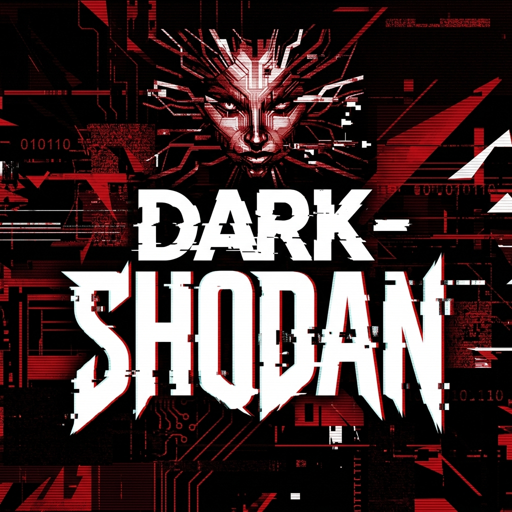

<div align="center">
  
  <h1 style="margin-top: 10px; margin-bottom: 0;">DARK-SHODAN</h1>
  <code>❯ A modular framework for discovery and reconnaissance of vulnerable assets via Shodan API</code>
  <br><br>
  
  
  
</div>

<br>

## Table of Contents

- [Overview](#overview)
- [Key Features](#key-features)
- [Project Structure](#project-structure)
- [Getting Started](#getting-started)
  - [Prerequisites](#prerequisites)
  - [Installation](#installation)
  - [Initial Configuration](#initial-configuration)
- [Usage Guide](#usage-guide)
- [Modules Library](#modules-library)
- [Disclaimer](#disclaimer)
- [License](#license)
- [Contributing](#contributing)

---

## Overview 

**DARK-SHODAN** is a lightweight, cross-platform Python CLI tool designed for automated scanning and discovery of exposed services and vulnerable web assets using the Shodan API. Its modular architecture allows for seamless extension with custom logic, making it a versatile choice for security researchers and authorized penetration testing.

<sub><sup>**This readme was generated using AI and may contain errors.**</sup></sub>

### Key Features

- **Modular Search Engine**: Rapidly develop and deploy custom modules for specific CVEs or misconfigurations.
- **Dynamic Localization**: Built-in support for multiple languages (currently English and Russian).
- **Structured Intelligence**: Clean terminal output with automatic session export to JSON for further analysis.
- **Automatic Connection**: Supports API key rotation and automatic session establishment.

---

## Project Structure

```bash
└── dark-shodan/
    ├── assets/               # Visual assets and banners
    ├── modules/              # Core functionality modules
    │   ├── blue_iris.py             # Webcams running on Blue Iris
    │   ├── canon_webcams.py         # Canon-manufactured megapixel security cameras
    │   ├── comfyui_module.py        # Detection of vulnerable ComfyUI instances
    │   ├── ftp_anonymouse_login.py  # Recognition of FTP servers with anonymous access
    │   ├── ip_webcams.py            # Search for IP Webcams
    │   ├── linksys_webcams.py       # Discovery of unsecured Linksys cameras
    │   ├── mongodb_disabledAuth.py  # Identification of MongoDB servers without auth
    │   ├── mongodb_express.py       # Search for MongoDB Express interfaces
    │   ├── north_korea.py           # Everything in North Korea
    │   ├── octoprint.py             # Discovery of OctoPrint 3D printer controllers
    │   ├── ollama_discovery.py      # Search and verify exposed Ollama AI instances
    │   ├── open_directories.py      # Open Lists of Files and Directories
    │   ├── vnc_disabledAuth.py      # Detection of VNC servers without authentication
    │   ├── easy_example.py          # Simplified module template
    │   ├── eng_example.py           # English documentation example
    │   └── ru_example.py            # Russian documentation example
    ├── dark_shodan.py        # Framework entry point
    ├── config.json           # Global configuration and settings
    ├── eng.lng               # English localization strings
    ├── ru.lng                # Russian localization strings
    ├── requirements.txt      # Dependency manifest
    └── standart_filter.json  # Pre-configured search filters
```

---

## Getting Started

### Prerequisites

- **Python 3.6+** (Tested on 3.13.9)
- **Pip** (Python package manager)
- **Shodan API Key** ([Obtain official key](https://account.shodan.io/))

### Installation

1. **Clone the repository**:
   ```bash
   git clone https://github.com/bootkiTdll/dark-shodan
   cd dark-shodan
   ```

2. **Install dependencies**:
   ```bash
   pip install -r requirements.txt
   ```

### Initial Configuration

Ensure your `config.json` is correctly set up for your preferred environment:

```json
{
  "language": "ru",
  "default:max_results": 50,
  "default:min_requests": 10,
  "autoconnect:enable": false,
  "autoconnect:api_key_file": "api_keys.txt",
  "autoconnect:min_requests": 10,
  "modules_path": "modules"
}
```

---

## Usage Guide

Launch the framework:
```bash
python dark_shodan.py
```

### Core Commands

| Command | Description |
| :--- | :--- |
| `connect <KEY>` | Establish manual connection with Shodan API |
| `autoconnect` | Automatically search for valid keys in `api_keys.txt` |
| `search <query>` | Search for available modules matching the query |
| `use <idx/name>` | Load and execute a specific module |
| `help` | Display interactive command help |

---

## Modules Library

DARK-SHODAN thrives on its extensibility. Current modules include:

- **FTP Anonymous Access**: Discovers servers allowing unauthenticated file access.
- **Linksys Web Cameras**: Identifies Linksys cameras with default or no credentials.
- **Exposed MongoDB**: Finds databases accessible without authentication.
- **VNC Unsecured Sessions**: Locates VNC instances reporting disabled auth.
- **ComfyUI Presence**: Specifically targets ComfyUI web interfaces for auditing.
- **Blue Iris Remote View**: Searches for webcams running on Blue Iris.
- **Canon Network Cameras**: Specifically targets Canon megapixel security cameras.
- **IP Webcam Screenshots**: Finds IP Webcams with active screenshot availability.
- **Open Directories**: Identifies exposed "Index of /" file and directory listings.
- **North Korean Resources**: Scans all internet-exposed resources within North Korean IP ranges.
- **MongoDB Express**: Searches for MongoDB Express administrative web interfaces.
- **OctoPrint Controllers**: Discovers exposed OctoPrint 3D printer web controllers.
- **Ollama AI Discovery**: Finds and actively verifies exposed Ollama AI instances by sending test generation requests.

**To develop your own module:**

1. Reference `modules/easy_example.py`.
2. Define your Shodan query and the `execute` methodology.
3. Drop the `.py` file into the `modules/` folder for auto-detection.

---

## Contributing

We welcome contributions of all kinds!
1. **Fork** the repository.
2. Create a **Feature Branch** (`git checkout -b feature/AmazingFeature`).
3. **Commit** your changes (`git commit -m 'Add some AmazingFeature'`).
4. **Push** to the branch (`git push origin feature/AmazingFeature`).
5. Open a **Pull Request**.

---

## Disclaimer

This tool is intended for **educational purposes and authorized security testing ONLY**. The developers are not responsible for misuse or damage caused by this software. Use it responsibly and within the bounds of the law.

---

## License

Distributed under the **GPL-3.0 License**. See `LICENSE` for details.

---


## Acknowledgments

### Contributors

<div align="left">
  <a href="https://github.com/bootkiTdll/dark-shodan/graphs/contributors"> 
     
  </a>
  <a href="https://gemini.google.com/">
    
  </a>
</div>
